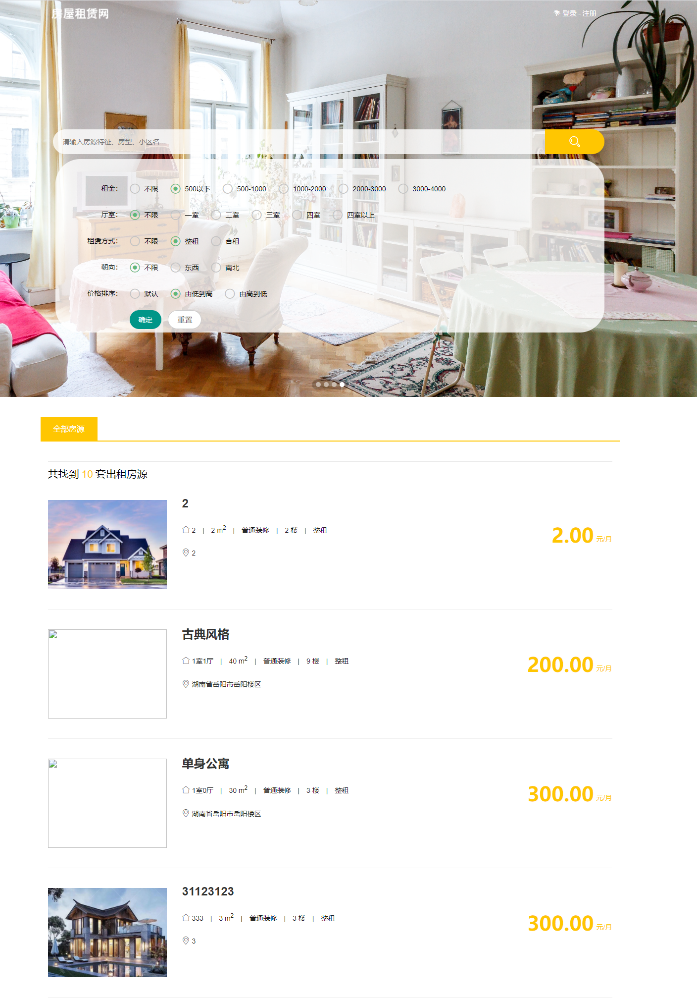
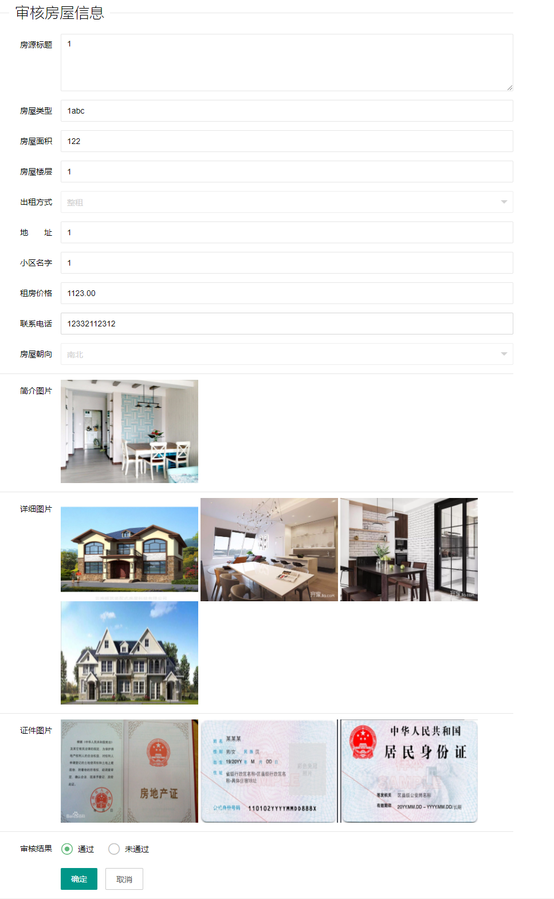
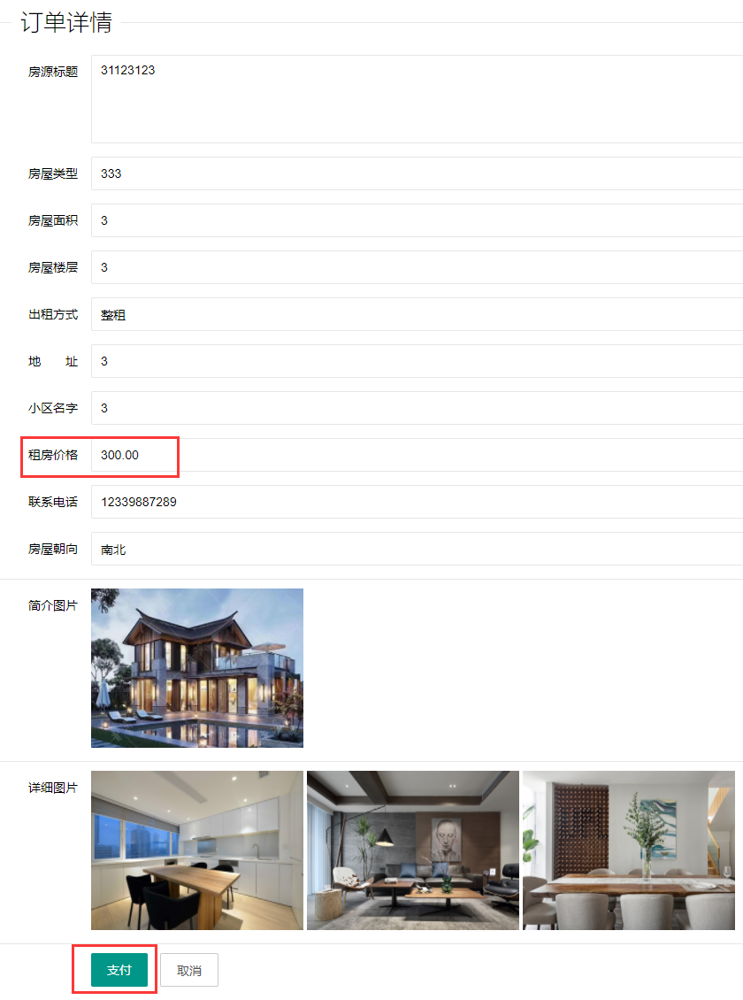
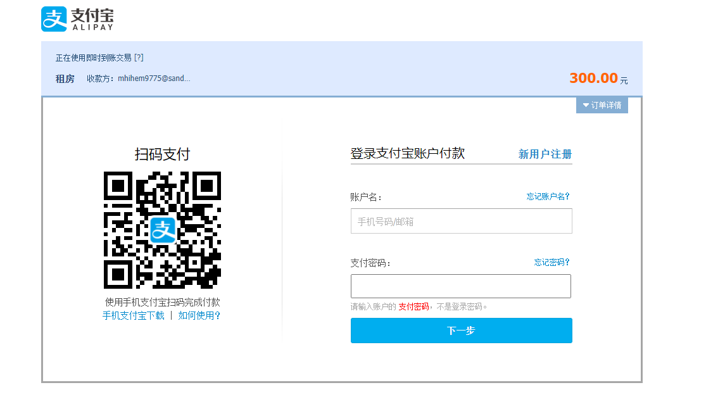
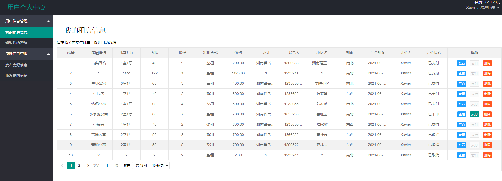

    <h1 align="center">房屋租赁系统</h1>

	
    
    
    
    

## 简介

> 房屋租赁系统，基于 Spring5.x 和 Mybatis3.x 的实战项目。

## 特征

- <b>基本：</b>实现不同用户之间的收藏房源。
- <b>多用户：</b>普通用户与管理员各自都能发布房源信息
- <b>审核：</b>管理员需要对用户的房源进行审核，才能让够上线
- <b>图片：</b>使用阿里云的OSS进行图片的上传与预览显示
- <b>支付：</b>使用支付宝沙箱模进行房屋的支付
- <b>开发环境：</b>前端 `Layui`，后端 `Spring` `SpringMVC` `MyBatis`，测试`Swagger`
- <b>· · ·</b>

## 环境

- <b>IntelliJ IDEA</b>

- <b>Mysql 5.7</b>

- <b>Tomcat 9.x</b>

- <b>JDK 1.8</b>

## 缩略图

## 部署说明
- <b>1.支付宝沙箱配置：</b>将AlipayConfig.class中的app_id、merchant_private_key、alipay_public_key替换为自己的参数，
具体配置过程：[https://blog.csdn.net/qq_20042935/article/details/106146481](https://blog.csdn.net/qq_20042935/article/details/106146481)

- <b>2.阿里云OSS配置：</b>将OSSUtils.class中的endpoint、accessKeyId、accessKeySecret、bucket替换为自己的参数，
具体配置过程：[https://www.wxpmo.com/helpdetail/id/1161.html](https://www.wxpmo.com/helpdetail/id/1161.html)

- <b>3.数据库配置：</b>将项目内的house.sql导入到数据库中，然后在database.properties中修改自己的数据库的账号密码

- <b>4.程序的端口号默认为8088，若想自定义端口号，记得修改AlipayConfig.class中的notify_url与return_url中的端口号</b>

## 其他说明
- <b>1.进入支付页面后，提示存在钓鱼风险，解决方案如下：</b>[https://blog.csdn.net/weixin_40652498/article/details/104201892](https://blog.csdn.net/weixin_40652498/article/details/104201892)

- <b>2.支付完成后，若返回用户个人中心页面，则说明支付成功；若只停留在支付宝的支付成功页面，则是支付失败的，这是支付宝的沙箱支付问题，与本系统无关，多试几次即可</b>

## License

[MIT](http://opensource.org/licenses/MIT)

